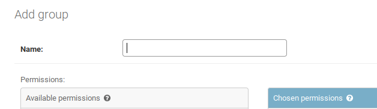
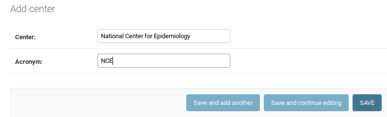
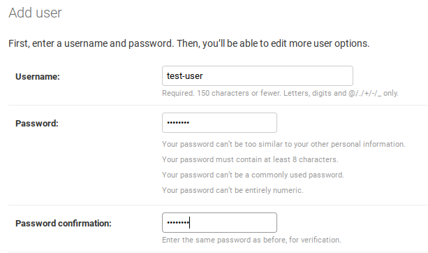
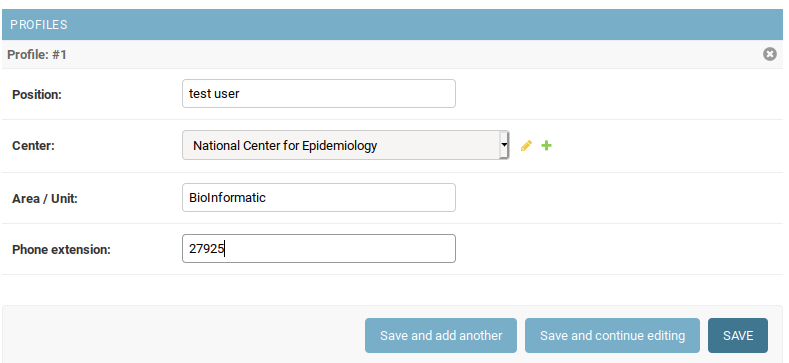
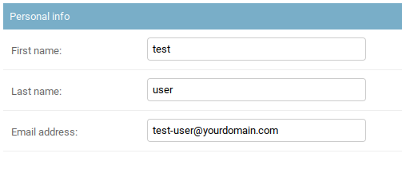
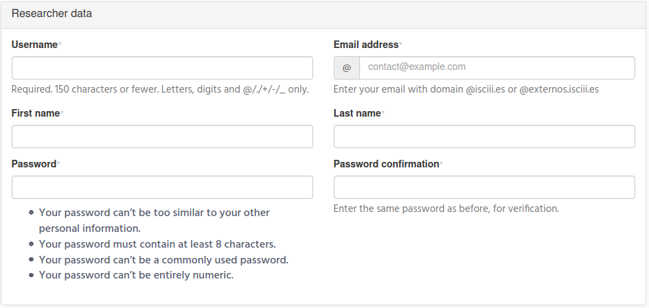
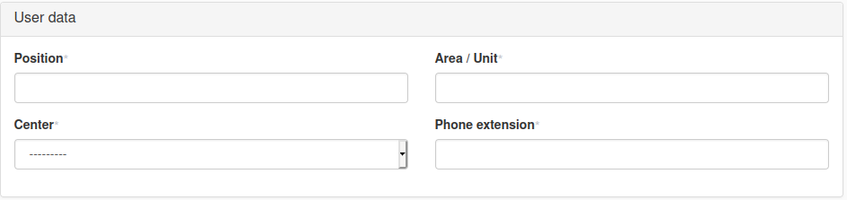
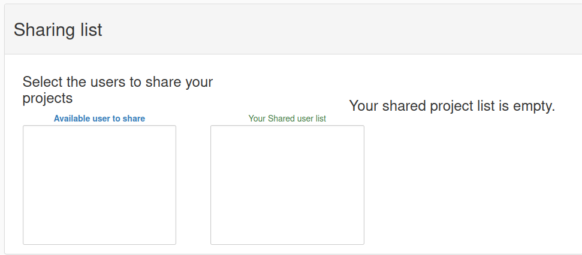

# Admin Global Configuration
============================

The scope of iSkyLIMS was that, it could be used for different organization with different requirements when handling samples in the laboratory.

This flexibility makes that you need to configure iSkyLIMS to adapt it, to get similar to your ways of working.

We are aware that a tool that claims to be commonly used, never will fit at 100% your needs, but this initial configuration iSkyLIMS tries to fit your main requirements.

There are 2 ways to define the configuration that iSkyLIMS uses for sampling tracking control:
*   Using Django admin menu
*   iSkyLIMS Customized forms

For the first one, it is used to define simple information, then in most cases consists only in one field.

For the rest of settings information, a customized form is creating for each specific needs.

## Group and User Definition

To use iSkyLIMS is mandatory to login in the tool. For that purpose, one of the first steps in the configuration is to define the user that can access to iSkyLIMS and the role that each user has in iSkyLIMS.

For each module there are 2 types of roles:
*   Manager. Which it is the responsible for defining the main parameters to be used and the access to see information from normal users.
*   User. Responsible for adding information to their own samples.

A user can only belong to one of these roles and by default when user is created on iSkyLIMS it has no group, meaning that they are normal user, does not have Manager privileges.
### Groups definition

By default, 3 groups (“WetlabManager”, “ServiceManager” and “ClinicManager”) are defined during the installation process.

These are the groups that are used for iSkyLIMS and you do not need add new, but if for any reason you need to rename any of the group, then after login as “admin” user, open your Navigator and type:

```
http://<server_name or IP_address>/admin/auth/group/
```

Use your iSkyLIMS admin credentials to access to the group definition webpage.



Type the name of the group and click on the “SAVE” button to apply your changes.

```
IMPORTANT
Do not add any available permissions to the group.
These are the Django permissions to access to database table.
Adding permissions could make unpredictable errors in iSkyLIMS
```

### Centers Definition
Define the centers that will be in your organization using your admin credentials. Open your Navigator and type
```
http://<server_name or IP_address>/admin/django_utils/center
```


Type the Center Name and the Acronym used for the Center and click on the SAVE bottom to apply your changes.

Repeat the process for all Center that are applicable in your organization.

### New User Definition
To use iSkyLIMS the user must be logged in, to validate the access credentials.
To create a new user in iSkyLIMS there are 2 possible options:
*   Admin user define the new user.
*   Users register themselves.

For the first option after login with your admin credential, open your Navigator and type
```
http://<server_name or IP_address>/admin/auth/user
```
You will get the Django administration form to create a new user.



Type the username and the password

From the Profile section, assign the user to the right Center that his/her belongs to from the available Center that you define in the previous step.


Add the additional information and click on the SAVE bottom.
A new page is presented to add additional information


Scroll down to the personal info and enter the “First name”, “Last name” and the email address.


At this moment you could also assign the admin permission to this user, by selecting the “Staff status” check box.

However, it is recommended that only admin user can access to the Django administration, to prevent that existing information could be deleted/altered by error.

At this point, you can define if this new user will have the manager role for any of the modules or for all of them. To define user roles, just select them on the Available groups and click on the “arrow” icon to move them to the “Chosen group”.
iSkyLIMS does not use the “Available user permission”, keep all of them in this panel.

The **second option** for creating a new user, we mention before, is that the user himself register in iSkyLIMS.

The new user needs to open the navigator, going to the main iSkyLIMS page to click on REGISTER button located in the menu.


Then the registration form is showed and user can enter the credential information.




By using this way of user creation, user cannot assign himself to any of the manager groups. So this procedure will be used mainly by the user which are not required to have manager privileges.
But of course, admin user can assign manager privileges, for user that have register by themselves.

### Sharing List

Scrolling down to the form there is a section called “Sharing list”.



The reason for having the sharing list it is quite simple. As we said, a normal user can only see/modify the samples/ analysis/ service request, etc that belong to him. So he is the responsible for the information included in iSkyLIMS.
However, there are situations that this behavior needs to be changed because other people in their team needs to take over the activities, because of illness, vacations, etc. Sometimes because the unit organization has a person responsible for requesting an activity that is different from the person owner of data.

This a clear example when all the requesting services are centralized in one person. This person cannot select in the requested form, the samples for the analysis, because he is not owner of any samples.
To solve this situation, the sharing list utility is created.  Each user can select the “friendly” users that are allow to see/modify/select the samples. To populate this list, the user, select the name of the people he wants to share in the “Available user to share” panel and click on the arrow icons to move them to “Your Shared user list” panel.

Then in the previous scenario, when the owner sample user adds, in their shared list, the name of the responsible for requesting a service, these samples will be displayed, for selecting in the form to create the service request.


## [Massive Sequencing Admin Configuration](massiveSequencing/adminConfiguration.md)
Click on the link above to continue the configuration on massive sequencing


## [Admin configuration in Requesting services](massiveSequencing/adminConfiguration.md)
Click on the link above to continue the configuration on massive sequencing
