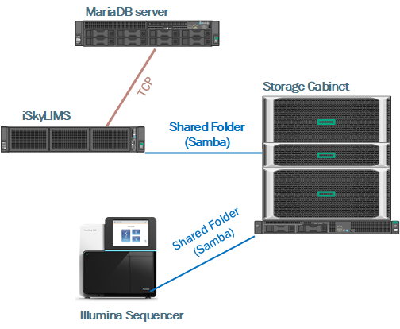

# Introduction

The scope of this new functionally in iSkyLIMS is to provide a friendly way to track your samples from the time it is received, track the process/manipulation of the samples, attach the information provided by the sequencer, until the investigator receives the output information from the analysis done using bioinformatics tools.

We have built iSkyLIMS, having in mind that different organization may have different ways of working and different parameters which you need to track on.

To achieve this goal, iSkyLIMS is now modular to give you the chance to install only the functionality that you need it.
So far 3 different modules have been implemented:

+   Clinic
+   Massive Sequencing
+   Requesting Services

**Clinic module** is focus on the information related to Patient. Where personal data, patient samples, and historical information are stored. In that way we can track the patient and the test to provide a better acknowledge of the patient illness.

Clinic module is not planned to keep track of the full patient history, in no way is planned to replace the track that a doctor has about their patient, but the main reason to have personal patient data is for these kind of samples, where information like patient age, patient sex, previous symptom, etc, are inputs to provide the results.

**Massive Sequencing** is designed for tracking samples, from DNA/RNA extraction, until they are sequencing, going on the different steps like:
+   library preparation
+   pool creation
+   etc.

It allows to define customized quality parameters to check sample quality.

The tracking is also extended to the kits that are used in the laboratory in each steps, with the scope to identify if a Lot kit cannot longer be used due to bad quality on the samples.

**Requesting Services** is the next logical step for processing samples using bioinformatics tools, then this module is mainly used for the bioinformatics units. The kind of services can be customized to have only the ones that units offer because of the competence/service agreement contract.

Having this modularity allows that information is stored once (in modules you are working on) but information can be shared on the different modules.

So for example, when recording a new sample, it can be done either using Clinic module form or Massive Sequencing form.  The sample will be available for each of the modules, and the recommended way to record a new sample is to use the clinic module if you need to fill personal data about the patient or to use Massive Sequencing if you do not have the patient data.

---
**IMPORTANT:**

Sample name must be unique, to avoid samples duplication.

---

Sometimes, because of the normal sample life process it requires to reuse the sample, like for example to repeat the DNA extraction. In this case, many people name the sample adding “rep” at the end, however this is considered a bad practice, because original sample has not changed. iSkyLIMS allows to specify which process needs to be repeted selecting the sample and clicking on the right option.

## Sample life cycle

Sample is the basic core element of the iSkyLIMS. Around the sample, tables in database and lines of code are built to create the functionality in iSkyLIMS.

## Pre-requisites

In the installation documentation we detailed the requisites that iSkyLIMS needs for the installation, however in this section we will mention which are the pre-requisites that are needed for iSkyLIMS to work.
*   The output files generated by the sequencer must be accessible in open read mode.
*   When running the bcl2fastq for sample demultiplexing, the program requires that sample sheet file is in the sequencer run output folder. iSkyLIMS can copy this file into the right output run folder, but for copying the sample sheet file it required that folder is mounted with write permissions for "apache" user. In case that it was not possible, sample sheet file must be copied manually by an user with write permission to copy the file.
*   The conversion from bcl2fastq is not part of iSkyLIMS. This means that an automatic script must be done as part of your organization process.

## External Connections
iSkyLIMS is not an isolated application, it requires to connect towards external storage container where data generated by the sequencer is storage.
The following figure show in a very basic way the external communications towards other servers.

## Which application need to use?

## Limitations
We are aware that it is a huge number of combination that a LIMS need to be handled.

We are trying to cover the needs that it was used in our lab and we have extended the possibilities to cover more scenarios, but so far we cannot fix all of them.
Anyway we are happy to receive your improvements.

The main limitations are:
*   Only is supported the illumine massive sequencer. So far only MiSeq, NextSeq and NovaSeq sequencers are supported.
*   Output files that sequencer generates, are only fetched using Samba.
