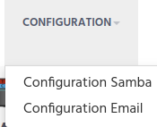
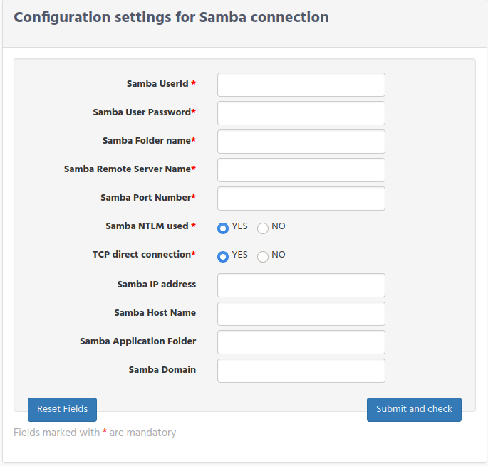
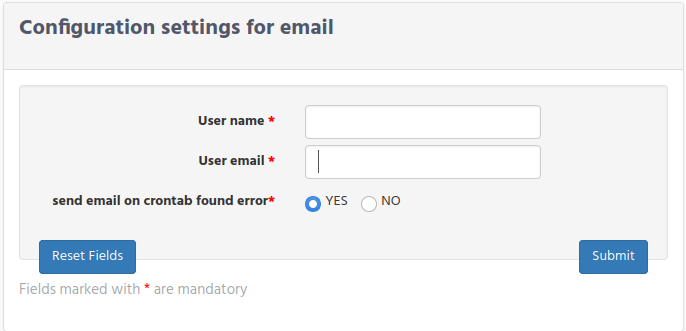

# Wetlab Admin configuration

When selecting the available options in the user forms, these values require that they are created in advance, to allow them to be selected. These forms are available only If the logged user has manager permission.

Be aware, that the pre-requisites we are going to describe in this chapter are applicable for at least 2 of the 3 iSkyLIMS modules, and in order do not repeat again they are described only once. But keep in mind that using more than one module you need to repeat them in each module. The reason for that behaviour is to get only the option values that are applicable for your needs in each of the module application.

So for example on clinic module, you define “human” as the sample species, because most of samples are from human, however if the massive module, you do not need to define human as sample because you are only working with sample from mouse or bacterial.

For a better understanding we are going to specify them in the definition area that they are required.
In the previous settings, as you can see, the changes are done using the Django administration utility. For the following configuration several customized forms are created, and only available when user “admin” is logged into iSkyLIMS.

There are 2 configurations that you can define for Massive Sequencing application:
*   Samba Configuration
*   Email Configuration

# Samba Configuration

In the Introduction chapter we mention that iSkyLIMS needs to open a Samba connection towards the storage container where sequencer left the output files generated while sequencing.

Depends on your particular samba configuration it is required to set some values while other are not used and they must be blank.

Sometimes could be take some time to get the right settings values. To help you we have create a form where you can define the settings and correct them until you get the right ones.

To get access to configuration option you must be logged as “admin” user. I mean exactly this, user must be admin, not any other user which admin privileges.

Click on the Configuration Samba on “CONFIGURATION” link to get the Samba settings form.

When form is open you can see that there are 2 groups:
*   Mandatory fields (the ones with red *)
*   “Optional” fields

From the mandatory fields you have to fill:
*   **Samba Userid**, is the user_id on the shared server.
*   **Samba User Password**. Password of the user to be used for the connection.
*   **Samba Folder Name**, it is the name of the shared folder.
*   **Samba Remote Server Name**, is the name that the shared folder server has in the system.
*   **Samba Port Number**, is the Samba used port. The most used value is 445.
*   **Samba NTLM used**, and **TCP direct connection* are values that can be True or False depending on your particular configuration.

The four remaining fields does not mean that all of them could be empty, but in some cases some of them are exclusive.
This happens when the next following inputs:
*   Samba IP Address.
*   Samba Host name.

You have to fill one of them, if the shared container is configured to be accessible by IP then you type the IP address, or use the Host name if it is configured to be reachable by a name rather than a static IP.

*   **Samba IP address**, is the IP address of the shared server.

*   **Samba Host Name**. In some of the Shared Folder solutions, the server is not reached by a single IP address, but for a set of IPs that are dynamic offered to the client. In this case the way that this server is accessible is using the hostname. If this scenario is the one you are using, then leave empty the Samba IP address, and type the host name in this field.

The other 2 fields are optional and you have only to define if they must have a value.

*   **Samba application folder**. This in the case that under the main shared folder in your organization data are separated, creating a dedicated folder for the Sequencer.
*   **Samba domain**. If the user that need to login is under a domain, you must type the domain name, in case is not needed left if blank.

When all this information is typed click on the “Submit and check”.  iSkyLIMS, performs a connection to check is the input values are ok.

If the connection is not successful then the form is presented again, with the input values used, to help you to changes only values that you want to change to make another verification.
If the connection is successfully created, then information is recorded on database and successful page is showed.

# Email configuration

When running the crontab for Massive Sequencing application, a Run could change its state if found an error, which prevent to complete the automatic process.

Defining the configuration email settings, you can decide, which user will receive the email.

It is recommended that box email is used to allow that several users could get the email and look into the problem.

---
# Crontab settings

CRONJOBS = [
('0 */2 0 * *', 'iSkyLIMS_wetlab.cron.looking_for_new_runs', '>>' + LOG_CRONTAB_FILE),
