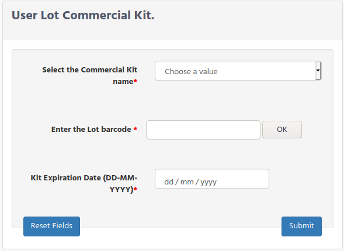
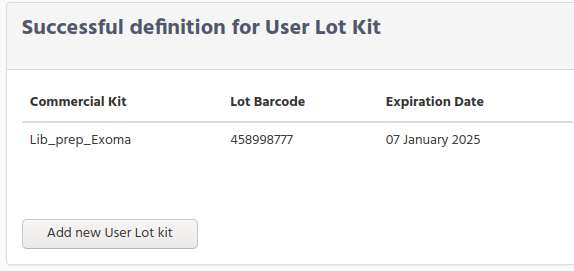

# Investigator Configuration

The required configuration for the Investigator is more simple.
It is only need to define the user lot kit that are using in the laboratory.

## User Lot Kit Configuration

The investigator configuration consists on defining the lot kits that are going to  be used on the experiment/diagnosis.

To define them, the investigator selects the “Add User Lot Commercial Kit” from the menu.  
The investigator will get a new page to write down, following information:

Select the Commercial Kit name. We mention during the wetlab configuration that  Wetlab Manager is the responsible to define and to write down the common information for the "Commercial Kits". Then now by selecting the commercial kit name we are linking the main information to the only 2 fields requested in the form:  
*   **Lot barcode** Enter the barcode from the box kit. You can enter manually de digits or you can use a lector kit.
*   **Expiration Date** . Select from the display calender the date.

**Note**.-  
Kits which have already reach the expired date are still showed on the selection list.  
When a lot kit is exhausted, go to the inventory option in the main menu and click on the "run out" box.

After submit the form you get the confirmation page

Click on the " Add new User Lot kit" button to add more lot kits.
