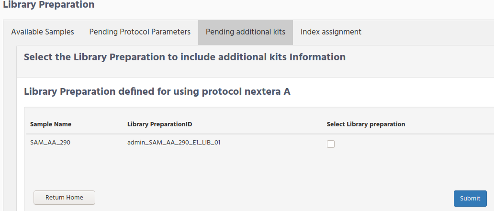

# Investigator workflow

The activities that Investigator needs to do in iSkyLIMS is enter the data that are collected during sample manipulation.  
These activities required for massive sequencing are separated in 3 main steps:

1. Record new sample.
2. Molecule extraction.
3. Library preparation.

The figure below shows the workflow activities from the time the new sample is recorded in iSkyLIMS until sample is included in the sequencer.

## Record new Sample

At this point, we assume that the requirements defined on, [WetlabManager workflow](wetlabManagerWorkflow.md) are defined.

To record a new sample (or a set of them) select “Record Samples” from the RUN PREPARATION menu.  

> Any logged user can record new samples.  
>Because in some organization there is one person which receives all samples and he/she is responsible to recorded them.   
>But it is also possible, that every one in the laboratory recorded their own sample.  
> For those reason any user can record new samples.

As we already mention the recorded sample option is available for all registered users, but **once a sample was recorded**  by a user, he/she is the only one allowed to add information.

In the record sample form, you can extend it to fit all samples that you need, by pressing “ENTER” key at the bottom line.

**Patient Code ID**. When personnel in the lab receives the sample in very rare cases you the full name of the patient, due to patient privacy you get only the coding value of the patient.  
You do not need to define in advance the patient code, iSyLIMS create a new entry on database or link this sample to the patient if it is already defined.

**Sample Name**. It is the identification code for a sample that is received in the lab.  
The sample name cannot be repeated, in order to avoid add information to a wrong sample, just because they are named the same. Then iSKyLIMS will not allow to define a new sample that is already defined, getting a warning message to rename the sample.
It is very common that some case samples need to be processed again, because of many reason. For these ones you do not need to define the sample, because it is already defined, but you have to specify which step need to be reprocessed.  
Sometimes for reprocessing again the sample, you need to require another/more sample for the patient. In this case you have to considered a new sample, which will have of course a new sample name. You can join these sample because they are assigned to the same patient.

**Sample Origin**. You will select from the option list the place from where the sample comes from, like the hospital name, organization name, laboratory name, etc. You only get the option from the ones that were defined in [WetlabManager configuration](wetlabManagerConfiguration.html#Samples-origin) Sample origin.

**Type of sample**. You select from the option list the type of sample that sample belongs to. The type of sample were defined [WetlabManager workflow](wetlabManagerWorkflow.md).

**Species**. Select for the option list the specie of the sample. Species list were defined in [WetlabManager configuration](wetlabManagerConfiguration.html#Species-definition) Species.

**Project/Service**. We have defined these 8 fields, which in most of the situations are not enough. To customized with the additional information that you need to set for each example iSkyLIMS allows you to defined your own fields. To select them you need to select from the option list the one that fit you. Remember that these projects were defined in [WetlabManager configuration](wetlabManagerConfiguration.html#Define-sample-project) sample Project.

**Date sample extraction**. Date were the sample was extracted from the patient. Do not set the date that you recorded in iSkyLIMS. Select the date from the calendar window.

**Sample Storage Location**. Besides to record de sample is important to track where the sample has been storage. This is a free text that you can write anything that helps to identify where the sample is located.
For each sample, all fields must be filled in, unless they were set as optional when defining the type of sample in [WetlabManager configuration](wetlabManagerConfiguration.html#Samples-origin) Samples Origin.

After submit the form, iSkyLIMS returns you back to this page in case that some mandatory information was missing.

### Recording additional sample information

When all samples in the previous menu are recorded you can have 2 different scenarios according if:
*   You need to add **additional information**, according to the project that was selected during sample definition.
*   **No additional** information is required.

For the first scenario, where you need to set more data to the sample, a new form is displayed to write this information.

Note that the fields that you see in the picture above, on the next column to Sample Name, are only for writing this document. The column names that you will get are the additional parameters that were defined at the time to Define a new Sample Project in [WetlabManager configuration](wetlabManagerConfiguration.html#Define-sample-project).

When setting information to the sample you can have 3 types of choices, according as the type of field was defining during the sample project creation.   
The field when you click on it you can have:
*   **Option list** to select one of the choices.
*   **Calendar window** to select the date.
*   **Normal text** to type directly on the field any character.

When all information is included in the form, click on the submit to save the additional information.  
You will get the confirmation that samples are successfully recorded.

### Recording pending additional sample information

In case you decided do not complete the additional information, not just after the form for adding additional sample information is showed, you can still add this information at any time.  
Select again from the main menu “**Record Samples**” and this time above to the form for recording a new sample you will get a table with the list of the pending samples which require adding more information.

In the table click on the check box for all samples that you need to add the information.

You will get the form to fill in, same form as described above, and when it was completed you will have the same windows confirmation.

## Molecule extraction

The next step after the sample is defined in iSkyLIMS is the process for **DNA/RNA extraction**.  

Select Handling Molecules” from the RUN PREPARATION menu.  

During this process the people in the laboratory will use specific commercial kits to extract the DNA/RNA.  
These kits, as we described in  [WetlabManager configuration](wetlabManagerConfiguration.html#define-commercial-kits) define Commercial kits for molecule extraction, the user with wetlab manager rights needs to define the commercial kits that are used in the lab for the DNA/RNA extraction.

Then using these kits as input the investigator has to define his/her own lot kit, as described in  [Investigator  configuration](investigatorConfiguration.html#User-lot-kit-configuration).Define User Lot Commercial Kit.  
Before starting the molecule extraction definition in iSkyLIMS, check that the protocol you want to use for this extraction is available form the select list. See chapter  [WetlabManager configuration](massiveSequencing/wetlabManagerConfiguration.html#Protocol-and-parameter-definitions) Protocol and Parameter definitions.

To handle the extraction molecule process in iSkyLIMS select “Handling Molecules” from the RUN PREPARATION menu.

In the new window you can see 3 tabs that you can select:
*   New Samples
*   My pending molecules
*   Molecules use specification

### New Samples

The first time you access to this panel you only have data in the “**New Samples**” tab, because the tab “**My pending molecules**” only shows the molecules that are you started to work with.

On **New Samples** you will see the samples that have been already define which need to start the extraction of DNA/RNA.

The sample field has the sample name, where you identify the sample that you need to work on, but also this table is displayed in date order, to help you to select the older samples.

**Sample Code ID** field can help you to select the samples that have been created by a user, in that way you can easily filter the ones that you need to work with.

To get more information of how Sample Code ID is built check the  [Understanding Code ID](understandingCodeID.md) in each step.

Select the samples that you are going to take over of and click on the submit button.

After submitting, you get a new page to assign the molecule protocol, as well as other information used for the extraction in an excel table format.

*   **Molecule type**. Select if you are going to use DNA or RNA extraction from the original sample.
*   **Type of Extraction**. Select Manual if the sample is pipetted, or Automated if a Robot is used.
*   **Extraction date**. Set the date from the extracted molecule process starts.
*   **Protocol to be used**. Select from the option list the protocol name that will be used for the extraction.

Note that for helping the selection of "protocol to be used", it is linked to the value that you select on the molecule type field.  
Then selecting for example DNA as type of molecule the option list that you can select are the ones that are defined to be used with DNA molecule.  
If you select first an option from the “Protocol to be used” field you will get the full list, containing the protocols used for DNA as well as RNA.

You can select now the one that you will use, however when selecting Molecule Type field, the value that you select on the protocol is reset. So it is recommended to select the molecule type first and then the protocol from the option list.  
When you submit the information these samples, they will store in database and also they will assign to you as the owner. From now on, you (or the user in your friend list) are the only one that can set the parameter values.
Keep in mind that at the time you get this page to include information, the samples have been not assign yet to you. Only when you click on the submit button they will.

### My pending molecules

In “**My pending molecules**” tab is displayed the molecules that are assigned to you and they require to fill the information with the parameter values defined in the selected protocol.

Check on the “Select Molecule” checkbox for the samples that you want to add the parameter information, and then click on the submit button.

To get more information of how Molecule Code ID is built check the chapter [Understanding the code ID](understandingCodeID.html#Molecule-codeID) Molecule CodeID.

For the selected samples you gets a new page where you need to write the parameter values that you get during the extraction process in the lab.

For each sample you have to select the Lot kit that you use for the extraction.

The option values that you get are the “Lot barcode” that you write at the time that you define the lot kit [Investigator Configuration](investigatorConfiguration.html#User-lot-kit-configuration) User Lot Commercial Kit.

>Note that “lot kit” with expired date are showed in the available list. Only the "User Lot Kits" which manually are set as "Run Out" are not displayed.

It is not allow to save these parameters if the lot commercial kit is not set in the form. To advice to user that he is running out of the Lot kits, because either they are not defined yet or all lot kits have reached the expired date, this scenario a warning message is displayed to correct this situation.

After submit the successful information a confirmation page is displayed.

### Molecules use specification

Once the parameter values for the extraction molecules are defined the next step is to select the use that this molecule will have.

Then click on the “Molecules use specification” tab to know the samples that are pending for defining the use.

**Molecule use for**. Select from the option list the use of each sample. The option values that you get are the ones that were defined in  Molecule use definition.

On this step the sample can follow 2 different process according to the use.
1. No massive sequencing is required
2. Requires massive sequencing

For the first case, when you are using the extracted DNA sample for non massive sequencing, like per example for PCR. The sample will not be present in the available sample to add the information related to massive sequencing preparations.

On the second case the sample will continue with the process described in the next chapter.

## Handling Library Preparation

Select Handling Library Preparation from the RUN PREPARATION menu.

For handling the  library preparation process we have divided in 4 steps:
*   Available Samples
*   Pending Protocol Parameters
*   Pending additional Kits
*   Index assignment

### Available Samples

When click on the "Available Samples" tabs you will see the samples that in the last step, for molecule extraction preparation, we assigned that the sample will continue using massive Sequencing.

In this form you need to select one of the library preparation protocol that wetlab manager defined at [WetlabManager Configuration](wetlabManagerConfiguration.html#Protocol-and-parameters-definitions) Protocol and Parameters definitions

Select the library preparation protocol for each sample and submit the form

### Pending Protocol Parameters

When you submit the "Available Samples form" you get a new form to set the parameters defined for the selected protocol.  

> The columns names that you will get after the "library Preparation Code ID" will be different. Remember that the names that you see in the figure are for the purpose of writing this document.

After submit you will get a confirmation page that information was updated. Click on the "Return Library Preparation" bottom to add information for the additional kits, or for handling another set of samples.

### Pending additional Kits

Sometimes that instead of using a unique kit for your library preparation, you need  to use several kits.
For that reason we have included this option inside iSkyLIMS.

There are 2 steps for adding these kits.
*   Select the samples to add the kits

> In this form the samples are grouped by protocol.
>
> It means that you will have 2 forms if the list of samples, which require to add the additional kits, belongs to 2 different library preparation protocols

*   Select the lot kit used for the library preparation

> Remember that the additional kits were defined on  [WetlabManager Configuration](wetlabManagerConfiguration.html#additional-kits-for-library-preparation) Additional kits for Library Preparation

All these fields are optional and left empty if the additional kits was not used for the library preparation.

Click on the submit bottom to save your changes.

### Index assignment

The last step. in iSkyLIMS, for adding the library preparation information is to include the index adapters used for each sample.

Before moving to this form, you need to create in advance the “sample sheet” file using the Illumina Experiment Manage (IEM).

> Please note that use of this tool is out of the scope of this user guide, we have created some examples (one for NextSeq and one for miSeq illumina sequencer), but if you need more information to know how to use the software you should contact with Illumina or their big community, for support.

The following table is an example for sample sheet file to describe the mandatory fields that must be in the file.

|Sample ID | Sample Name  | Sample_Plate  |Sample_Well | index  | I7_Index_ID | Sample_Project | Description |
|----------|--------------|---------------|------------|------|------|------|------|
| SAM_AA_290  |  SAM_AA_290 | Plate  | A01  |AR002   |CGATGT | Project name  | User ID  |

When creating the Sample Sheet using the Illumina Experiment Manager (IEM) software is important to define:

*  Sample Project
*  Description

**Sample Project**. You can write any name, and assign different samples to the same project, and of course have several project names in the file.

The name of the project has no any relation with the "sample project" that we mention at [Recording additional sample information](#recording-additional-sample-information). You can name with the same name, because they are handled in complete different way inside iSkyLIMS.

To handle different organization requirements, it is possible to repeat the project name in different runs. To unable this option you have to set this "ON".

**Description**. This field **must have the userid** of the responsible of the library preparation sample. The importance of this field is that we are going to link the sample with the user, to perform the user statistics.

If the sample has no userid or it is an invalid value, the sample sheet file will be reject.

Once you have the Sample Sheet file ready and it fully complies with the above requirements, you can upload it, using the "Browse bottom" that is in **Index assignment** tab.

**Select Sequencer Platform**. click the on bottom for the sequencer platform used for the run

**Select Configuration**. Select from the list of the available configuration.

The list of the sequencer configuration was described on  [WetlabManager Configuration](wetlabManagerConfiguration.html#sequencer-platform-configuration) Sequencer Platform Configuration.

Once you have filled the sample sheet file you need to upload to iSkyLIMS.
The process is quite simple. Select “**Handling Library Preparation**” from the RUN PREPARATION menu.
