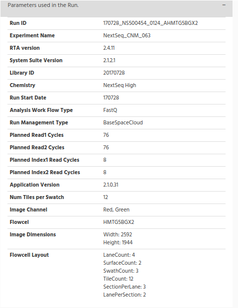
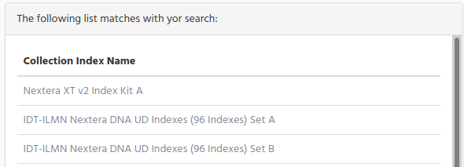

# Massive Sequencing Search

During the steps done before, in the previous chapters, we stored information in iSkyLIMS database. There are different ways to get the information stored and present it you. One of the way is by searching specific information to get back only this piece of information stored on database.  

In the following chapters we describe the fields in the form and the result that you get when applying your query.

## Get latest Run

Many times we need to check the status of the last run created on iSkyLIMS. To identify for example if the Illumina Sequencer has completed, or there was any kind of error when fetching and processing the output files from the sequencer.

To have a fast way to check it we have created a dedicate option on the menu. Select **Get Latest Run** from the Search menu.

It will automatically find the latest run recorded on iSkyLIMS and it present a page where you can see the status of the run as well as the rest of information available for the run.

In the picture below the Run is in “Recorded” state, remember that in this state the Run, was just created either by using the steps described in wetlab Manager Configuration **Create New Run** or **Create/Repeat New NextSeq Run**.

You can see the small piece of information that is available at this time, but even it is the first steps in the recording data for the run, you get valuable information like; the date where the Run was created, which organization request the Run on iSkyLIMS, and the original sample sheet file.

We want to highlight that when Run is on Recorded state you can make some actions on the Run definition:
*   Change the Run Name
*   Change the Library Kit

To change the Run Name, click on the "pencil" icon which it is close to the run name and you will get the run name change form to modify the name and submit the change.

Remember that the run name is important and it must be the same as it is in the runParameter.xml file created by the sequencer.

If after defining the run name you find out that it was not the right one you can change it by typing the corrected one and click on the submit button.

> Note that you can modify only the Run Name, when run is in Recorded state, once the run is moving forward this option is no longer available.

When run is in Recorded state you can also change the library kit used in the run in the same as was done for changing the run name.

## Get Incomplete Runs

Could be, that from time to time, you need to know, not for a single Run but for all, it they are finished, or there was any error when processing the output files.

For this proposal, we have created a direct option so you can quickly take a look at all the Run.  
Select the **Get incomplete Runs** from the Search menu.

Based on the pending "to be completed Runs" you can have more or less windows, because only if there is any run in this state the panel is showed. Well this is true for all the states but for the panel for Recorded Runs, it is always present even if there is no Runs in this state. We did it on propose to help you to identify if there is a run that is pending to run in the sequencer.

There is one dedicated window for the Runs that are in:
*   Error state
*   Cancelled

For the rest of the runs they are grouped and inside the “Runs pending to complete” window.
When you reach this page you can see on top that there are 2 windows.

On the left side you can see all Runs that are in Recorded state. Remember that the run in this state means that the run was created on iSkyLIMS, but the sequencer has not yet created the directory, on the shared folder.

The fields shown are:
*   Run Name
*   Recorded date
*   Number of days in recorded

Check this last column **Number of days in recorded** to identify if there was a problem with the run in the sequencer.
On the right side there is a graphic where you can see the percentage for each of these groups.

If you want to get more information of the run, click on the run name, and you will redirected to display run page.

Scrolling down the page you can see which runs are in Error and which ones have been cancelled.   
These windows are only show in case there are runs on theses state, if they are not presented means that you do not have run with errors or cancelled runs.

In the window for error runs you can see:
*   Run Name
*   Run date
*   State before error
*   Error type
*   Number of days

The information in **State before error** tell you in which state was the run before going to error.

> Remember that is the process for getting the information from the sequencer output files, where a run can move to Error

The information on the error type will give you an idea the error cause. The idea is that you correct the error manually and set back to the state previous to the error.

Once the fault was corrected, click on the run name link to get the run information page. On top you will see a window (in red) that summarize the error information.

On the bottom right there is a button **Corrected fault**.  
Click on the button and the run state will move back to the previous state before the error.

In this situation the run will enter again into the crontab and it will progress to the next step.
You will get a confirmation page that the change was done succcesfully.

Going back to the previous windows, before the parenthesis on correcting error, you can see that on the right side there are the runs that were cancelled. When we talking about that a run was cancelled we are considering only the situation that sequencer was stopped for any reason either was the user which decided to stop the run or because the sequencer stop for technical reason.
The information presented is:
*   Run Name
*   Run date
*   Number of days

Remember that the number of days are the number from the run was created until today.   
A run that were cancelled has no possibility to run again with the same name, because we assume that the samples in the plate are no longer valid and it is need to repeat the process to have new library preparation samples for creating a new plate.

The last window collect the information for the runs that were not in the previous states.

## Search by Run

The previous 2 options, in the search menu, are shortcuts for searching runs that are no completed.  
Now we are in the normal scenario when you need to get information for a specific run.

For searching runs select **Search by RUN** in the Search menu.

In the search run window there is one form on the left side and on the right side there is one small window, that when clicking on “Help” button a new window is open with a small description of each field.

The fields in the search are optional, which means that you do not need to fill all data for each one. Neither you need to write the full name of the run, you can type part of the run name, and you will get the runs that match with your query.

The input fields to make your query are:
Run Name. Enter the run name that you want to get. There is no limitation for the minimum length of characters that you can type on this field. You can type just only one letter or the full name of the run, but keep in mind that entering few characters in this field you will get many matches.
Platform.  
Choose one of the platform option in the select form. By default, the following platform were defined on iSkyLIMS during the installation:
*   Illumina: Mini-Seq
*   Illumina: Mi-Seq
*   Illumina:  Next-Seq
*   Illumina: Hi-Seq
*   Illumina: Hi-Seqx
*   IonTorrent: PGM
*   IonTorrent: S5
*   IonTorrent: S5-XL
*   Roche: 454
*   Other

Run state. Select one of the state that could have a Run.
*   From Start Date. Select the date from where you can to start your search.  When you click on this field select the date using the calendar window that the navigator shows to you.
*   End Date Search. Select the last date that a run was created.

If you do not type any date on the “End Date Search”, means that you get the run created after this day until today.

If you select only the “End Date Search” you get all runs created before this date.

If you type both dates you will get the runs that are between this range of date.

When you click on the submit button all the values you type will make and AND condition. It means that if you type in the run name and also select one options in Run state you will get all the runs that match your query.

After you submit your query, there are 2 possible scenarios that you can get:
*   Your query matches many Runs
*   Only Run match the query  

### Display Run information

On the first scenario you will get a list with all runs that matches your query. You can refine your search going back to the previous form and add more conditions to reduce the number of matches.
If you are happy with the list that you get, you can click on the run name to get the information for the run.

The second scenario that we mention above was that you get only one result. In this case the run information page is showed.

In the example below we have selected one Run that is completed, because in this way we can explain each of the information that is displayed. Remember that we collect this information from the output files of the sequencer (including the multiplexing done for bcl2fstq) and it is based on when this information is available, means that according to run progress state, you will get more information.

On the top of the run information you get that on the right side there is basic information about the run like:
State of the Run, the unit which requested the run, and at the bottom the Sample Sheet file used, which is ready for download when clicking on the “download” icon.

There are several dates that we store and it is important to know:
*   **Run was recorded on date**: It is the date that the run was created on iSkyLIMS.
*   **Run date**: It is the date that sequencer starts the process
*   **Run Completion Date**. It is the date that sequencer ends the sequencing process.
*   **Bcl2Fastq finish Date**. It is the date that the script for running bcl2fastq ends.
*   **Run Finish Date**. It is the date that iSkyLIMS finish to collect and process all the output files.

Another useful information is the disk space that run folder uses for output files. We are split this size in three categories:
*   Space used for images.
*   Space used for Fasta files
*   Space used for other files.

This information has two readings. For one side it indicates the space used on the file to help system administrator to identify a possible lack of disk space and for other side to see if the size of the files is less than it was expected, which could mean that there were some problems when sequencing the run.

On the right side there is a graphic which show the status of the Run. When it is completed the graphic show it at 100%, and when the run is recorded it is at 15%. In between and according to the run state a different percentage is showed. The percentage does not mean the time remaining until the run is completed but the percentage process executed on the run.  

Below the graphic is a small window to indicate the Run quality vs other Runs. The idea with this graphic was to indicate with a value that could summarize if a run has a good quality. This functionality is not implemented yet, because we need to collect more run and get which quality information are collected for other people, to decide which quality parameter and the importance of these, to assign a dedicated weight to get a number to indicate the overall quality.  
This functionality is not decided yet when it will be available, because it depends of external organization to provide us the information.

The next figure that you can see is the graphic to compare the “mean quality” and the “Q> 30” quality for your run and the ones that are executed on the same year and using the same Chemistry.

>Note that in order to present the different size of values that these 2 parameters have, the values have been normalized.

From the graphic data you can identify how good or bad was your run, comparing your data (in green colour) versus the runs in the year (in yellow/orange colour).

Below this graphic, on the right side, you can see the name of the projects that were included on this run. We have created this option to help you to move from the run to projects without searching for it.

Click on the project name to get the information collected for the project.

On the window below you can see the Index Library kit that was used for the run. We have given you the chance to modify the Index Library kit value by clicking on the pencil icon.

On the left side you can see a bar “Parameters used in the Run” in grey with a “+” sign. Click on the “+” to see the information used on the sequencer for the run.

The information collected here is the one which is included in the “runParameter.xml” file.

One parameter I would like to mention because is the RunID. The value is the directory on the shared folder. By checking this value, you can go directly to the directory where are all the files for the run.

We found this data very useful when need to troubleshoot on the run to see if there was missing files.

The next table shows the summary of the Flowcell for the run

*   **Clusters**. The number of clusters for each tile (in millions).
*   **Clusters (PF)**. The number of clusters passing filter for each tile (in millions).
*   **Yield (MBases)**. The number of bases sequenced which passed filter.

The next graphic shows the percentage of reads for each project and the reads that cannot been assigned to any of the projects.

The reason for this figure is that you could check if the number of reads for each project is in relation with the number of samples in the Run. It does not mean that if there are several projects inside a run they must have de same percentage of the run, because if one project has only 2 samples and the other project 20, you should have the same percentage relation in this graphic.

One important thing to mention is the bar for the “Unable to identify the project”. This bar represents the percentage of the reads than after demultiplexing during the bcl2fastq conversion the indexes of the samples did not match with the indexes defined in the sample sheet for each sample.

You normally get this percentage that cannot be assigned to any sample (at least it was our experience for several hundreds of runs that we have been working with), but the important is to how big is this percentage by comparing with the percentage on projects.  
If this percentage is small is fine, but it on the contrary is similar to the projects bar, then you should troubleshoot the reason behind this big number.

The table below split by lane for all project in the run

The reads that cannot be assigned to any sample, they are grouped and named "Unable to identify". In the bar graphic figure above you see the percentage, the following tables show the number of reads for Flowcell and lane summary.

The following table show the top list of the unknown barcodes, found in the run during the demultiplexing process. We have separated them by lane, to identify if the number of unknown barcodes are similar in all lanes, or on the contrary, if a lane has a big difference with the rest of lanes, which could mean that this lane was faulty.

When troubleshooting demultiplexing issues, this list can be used to compare the expected index sequences (those in the sample sheet) to those that were found. Some common causes for poor demultiplexing that these lists can reveal are:
*   Index sequences entered in the wrong orientation in the sample sheet.
*   Incorrect index sequences entered in the sample sheet (eg, Nextera vs TruSeq UD or index A001 vs index A006).
*   Sample mix ups between lanes.
*   Poor Index Read sequencing quality.
    *   Ns in the sequences represent positions where the base calling software was unable to make a base call.
    *   For sequencing systems using Illumina one-channel (iSeq) or two-channel SBS chemistry (MiniSeq, NextSeq 500/550 and NovaSeq), poly-G sequences indicate that no index sequence was read.  Poly-G sequences are typical for PhiX reads, which are not indexed.

In the table above shows the number of the unknown barcodes separated per lane, in the graphic below we have count all lanes and we show in a pie graphic to see the percentage for each one.

Scrolling down you see a pie chart graphic done from the unknown barcode data.

On the right side f the graphic there is a table which contains 2 columns:
*   Unknow Sequence
*   Index Matching

The reason for this table is to identify if when the sample sheet was created, it was assigned a different index that the ones used when physically the library preparation, as it was mention on the troubleshooting demultiplexing paragraph.
For example, “CTCTCTAC+AAAAAAAA” means that the index “CTCTCTAC” was found on the collection index kit, uploaded in iSkyLIMS. Then this index is showed in the Index Matching column. The index “AAAAAAAA” does not exist, nothing is showed in this case to see more clear that only one of the index was matched.

Other cases you can see are for example “GGGGGGGG+AGATCTCG” neither index “GGGGGGGG” nor “AGATCTCG” were found, and in the Index Matching the text “Index not match” is showed.

In case both of the indexes were found in the collection index kit stored on iSkyLIMS, both will be printed. For this situation you should troubleshoot on the sample sheet to identify a possible error when assigning the indexes.

When mention that index is not found, we do not say that this index does not exist, but for the collection index kit uploaded to iSkyLIMS, the index was not found.

On the bottom you can see the last part of information that is collected for the run. Three different tabs are defined:
*   Run Metrics
*   Lane Metrics
*   Charts

When click on **Run Metrics** tab you can see the following table.

When selecting the **Lane Metrics** tab, the run information split by lane is showed. Scroll horizontal to see all columns.

*   **Yield Total**. The number of bases sequenced, which is updated as the run progresses.
*   **Projected Yield**. The projected number of bases expected to be sequenced at the end of the run.
*   **Aligned (%)**. The percentage of the sample that aligned to the PhiX genome, which is determined for each level or read independently.
*   **Error Rate**. The calculated error rate of the reads that aligned to PhiX.
*   **% Intensity Cycle 1**. The corresponding intensity statistic at cycle 1
*   **%Q>=30**. The percentage of bases with a quality score of 30 or higher, respectively. This chart is generated after the 25 cycle, and the values represent the current cycle.

*   **Density(K/mm2)**. The density of clusters detected by image analysis (in thousands per mm2).
*   **Clusters PF**. The percentage of clusters passing filtering, +/- one standard deviation.
*   **% Phasing/Prephasing**. The value used by RTA for the percentage of molecules in a cluster for which sequencing falls behind (phasing) or jumps ahead (prephasing) the current cycle within a read, Read 1 and Read 2.
*   **Reads**. The number of clusters (in millions).
*   **%Q>=30**. The percentage of bases with a quality score of 30 or higher. This chart is generated after the 25th cycle, and the values represent the current cycle.
*   **Yield**. The number of bases sequenced which passed filter.
*   **Cycles Err Rated**. The number of cycles that have been error rated using PhiX, starting at cycle 1.
*   **Aligned (%)**. The percentage of the sample that aligned to the PhiX genome, which is determined for each level or read independently.
*   **Error Rate**. The calculated error rate, as determined by the PhiX alignment. Subsequent columns display the error rate for cycles 1–35, 1–75, and 1–100.
*   **% Intensity Cycle 1**. The corresponding intensity statistic at cycle 1

The last tab, Charts, show graphics to help you to check from a graphical way the quality of the run.  
The graphics that are showed are:

*   **Data by lane**. The Data by Lane pane shows plots that allow you to view quality metrics per lane.
*   **Flow Cell Chart**. The Flow Cell Chart shows colour-coded quality metrics per tile for the entire flow cell,
*   **Data by Cycle**. The Data by Cycle pane shows plots that allow you to follow the progression of quality metrics during a run.
*   **QScore Heatmap**. The Q-score heat map shows plots that allow you to view the Q-score by cycle.
*   **QScore Distribution**. The Q-score Distribution pane shows plots that allow you to view the number of reads by quality score. The quality score is cumulative for current cycle and previous cycles, and only reads that pass the quality filter are included. The quality scores are binned in groups: Q-score less than 20 in groups of 10, Q-scores 20–40 in groups of five, and one group of Q-scores above 40.

*   **Indexing QC**.

## Search by Project

When we were describing the information that is displayed in the run, we talked that there is a link where you can see
the project information. This is a way to get the project information, the other way is by searching by Project.  

Select the **Search by Project** option on the Search menu.

You will get a new form to indicate the values that you want to include for searching.  

**Project Name**. Enter the project name that you want to get. There is no limitation for the minimum length of characters that you can type on this field  
**Sequencer Machine**. Choose one of the Sequencer option in the select form.

**Run state**. Projects dates are always related to the run dates, for that reason we mention about the run dates and not to projects dates.
*   From Start Date. Select the date from where you can to start your search.  When you click on this field select the date using the calendar window that the navigator shows to you.
*   End Date. Select the last date that a project was created.

If you do not type any date on the “End Date”, means that you get the project created after this day until today.  
If you select only the “End Date Search” you get all projects created before this date.   
If you type both dates you will get the projects that are between this range of date.   

**Search from user name**. Enter the investigator userid.

When you click on the submit button all the values you type will make and AND condition. It means that if you type in the run name and also select one options in Run state you will get all the runs that match your query.

After you submit your query, there are 2 possible scenarios that you can get:
*   Your query matches many Projects
*   Only one project match.  

On the first scenario you will get a list with all projects that matches your query. You can refine your search going back to the previous form and add more conditions to reduce the number of matches.

Click on the project name, that you were looking for to get the project information

If only one project matches the query, the project information is displayed.

### Display Project information

The first window you see on top left contains basic information from the project. You can see the userID for the responsible of the project, dates, when project was recorded and the Collection Index Library Kit

Scroll down to see a table with the samples that are belongs to this project, with a summary information for each sample.
If you want to get information of one sample, click on the sample name to get a new page with sample information.

## Search by Sample

In the previous chapter we tell you the way for searching runs and project, now it is time for searching samples.  
As you will see it is very similar as the previous search.  
Select **Search by Sample** option from the SEARCH menu.

When searching a sample there are 2 type of samples that iSkyLIMS will search:
*   Samples which were defined in [Massive Sequencing Investigator workflow](investigatorWorkflow.md)
*   Sample names that are collecting from the sequencer output files

The fields that you have in the sample forms are:
*   **Sample name**: Write the full name of the sample or just part of the sample name.
*   **Sample State**: Choose an option from the select field. It is important to mention that this field only apply for the samples that were defined in [Massive Sequencing Investigator workflow](investigatorWorkflow.md)
*   **From Date**. Select the date from where you can to start your search.  When you click on this field select the date using the calendar window that the navigator shows to you.
*   **End Date**. Select the last date that a sample was created.

If you do not type any date on the “End Date”, means that you get the project created after this day until today.  
If you select only the “End Date” you get all samples created before this date.  
If you type both dates you will get the samples that are between this range of date.  

Although the search parameters are similar to the previous searches, however the results page will be a little different, because of these 2 types of sample definition.

---
To differentiate the two types of samples we will name:
*   **Samples**, which were defined in chapter "Massive Sequencing Investigator workflow"  
*   **Run samples** the ones collecting from the sequencer output files

Now you can get different results according to the matching results:
*   **Multiple matches in Samples and multiple matches on Run samples.**

*   **Only one match on Samples and multiple matches on Run samples.**

As you can see we have changed the normal behavior. When we were found only one match in run search or in projects search, it was displayed the full information of the run/project. We change because this time there are two different of queries that are triggered and you could be looking for the run quality information only.

*   **No match on Samples and multiple matches on Run samples.**

This a particular case that you will have when the searching conditions in your query only matches Run samples. For example, when you only have samples information from the legacy runs.

*   **Multiple matches on Samples and only one match on Run samples.**

You can get this scenario when you have defined samples, but not all of them are already handled by the sequencer.

*   **Multiple matches on Samples and no match on Run samples.**

As you can guess this is a particular case of the previous one, when the sequencer has not yet handled these samples. But as we mention before, when you are restricting your search based on the sample state, this field is only applicable for Samples group and not for the Run samples, for that reason when you select a sample state value the Run samples window will be always empty.  

*   Only one match on Samples or only one match on Run samples.

In case that either one match is found in Samples or only one match is found in Run samples you will get automatically the sample information window.

### Sample Display Information for Run Samples

When only one match is found for Run samples or when you click on one Run samples, then you get the information that was collected from the output files from the sequencer.

What you see on the Run sample information is on the left side the basic information about the sample, to know the project name and the run name that this sample belongs to.

You can click on the project name or run name. to see the project/run information.
On the right side there is a graphic to indicate the quality of the sample. This value is fetched from the percent of the quality >= Q30.
Below there is the quality information for the sample where you can see:
*   **indexes used**.
*   **PF Cluster**
*   **% of the Project**. That is the percentage of reads that this sample have in comparison with the rest of sample

*   **Yield** (in millions of bases)
*   **>=Q30**. It is the percentage of the reads that sample has with a quality bigger than 30
*   **Mean Quality Score**. It is the mean of all quality read in the sample.

The last window is a graphic that show the percentage of this sample (in red), comparing it with the rest of the samples in the project.  
From this graphic you can check if the sample percentage got based on the number of read it was as expected.

### Sample Display Information for Samples

When there was only one sample that matched your query or you clicked on one of the sample you will get all the sample information that have been recording for the sample from the moment it was created in iSkyLIMS.
Remember that this information is the one that it was manually added to iSkyLIMS through the different forms.
The first window is related to the basic information from sample definition, where you can see:
*   Sample Name. Name of the sample
*   Sample CodeID. Code assigned to the sample. Check Chapter 3.9.1 Sample_CodeID.
*   Sample State. State that has at this moment the sample, see Appendix 10.3 State Diagram.  Note that sample state changes in case of reusing sample see chapter 3.8 Reusing samples.
*   Recorded Date. Date from the sample was defined in iSkyLIMS.
*   Sample Type.
*   Species
*   Number of reused. Number of times that this sample was reused for a new molecule extraction, or new library preparation, etc. Each time that sample is reused this counter is stepped.
*   User. User ID of the person who defined the sample in iSkyLIMS.

## Search by Index Library

Sometimes you need to check any information for the collection index.  
When you are looking for the information that a specific collection index kit has, you can go to “Add collection Index Kit” inside the PRELIMINARY PREPARATION menu. Then look at the right side of the page and scroll down until you get the one that you are looking for, and click on the name to get the information.

But in many cases, what you need to know is which collection index kit has/have a particular index, or barcode, etc.
For that propose we have created a new search where you can find this information.

Select “Search by Index Library” inside SEARCH menu.

*   **Collection Index Kit name**. Write the collection index kit name (or part of it) for filter by this field.
*   **Adapter1**. Write the sequence used on the adapter1 that you want to search
*   **Adapter2**. Same as before but for adapter2
*   **Index name**. Write the index name used for I7 or for I5
*   **Index Sequence**. Write the index sequence that you want to search.

As it was commented before, any information that you type on the field is making an AND conditions.   
When you write the sequence to search in the “Index Sequence”, iSkyLIMS will check first if the sequence is either defined on I7 sequence or in the I5 sequence. In case there is not match the reverse complement of the sequence is calculated to try to find a match.

If there are more than one match then a list is displayed, to choose the right collection index kit that you were looking for.

Click on the collection index name to get full information.

Check the chapter [Define the Collection Index kits](wetlabManagerConfiguration.html#define-the-collection-index-kits) for detailed information.

## Search by User Lot Kit

Select “Search by User Lot Kit” inside SEARCH menu.

*   **Lot Number**. Number of the Lot Kit
*   **Commercial kit**. Name of the commercial kit
*   **Protocol handled by User Kit**. Select a protocol from the list, which was defined for using a commercial kit
*   **Platform User Kit**. Select a platform from the list, used for the commercial kit
*   **End date to be expired**. List of the User Lot Kits than expired before the selected date.
*   **Exclude Run Out**. Exclude from the search the User Lot Kits that are Run Out.

Again you get 2 possible results, either a list of the User Lot Kits that match your request

Or just the User Lot Kit infromation in case than only one result matches the condition request.

### Display User Lot Kit Information

