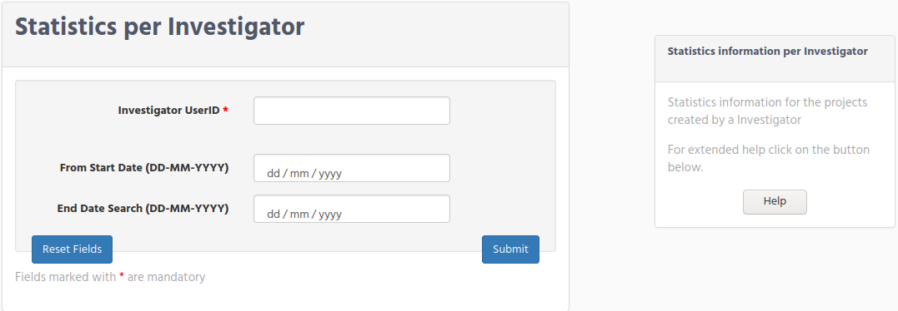

# Massive Sequencing Statistics

In the previous chapter we see the way that you can fetch information, about runs, projects, and samples. In this chapter we describe, the different statistics that you can get using iSkyLIMS.
So far have been created the following statistics:

*   Statistics per Investigator
*   Statistics for a period of time
*   Statistics per sequencer
*   Statistics library kit Quality

## Statistics per Investigator

Statistics per Investigator will show the information for the investigator and provide graphic to compare the investigator against the rest of investigators defined in iSkyLIMS.
To select this statistics, select “Projects per investigator” in the STATISTICS menu.

In the form that you get there are 3 fields.
The mandatory parameter is of course the investigator userID.
The other two fields related to dates are optional.

If no dates are defined in the forms iSkyLIMS provide you the statistics for all period, that the investigator was handling projects in the system.

If only the start date is defined, then you get statistics values from this date until today.
If on the contrary, you define the end date you get the statistics from the first day that Investigator was involved in a project until the end date you defined.
After you submit the data, you get a new page having the statistics related to the investigator.
So the first information that you get are the project that investigator was involved, displaying the following information:

### Display Investigator statistics

*   Project Name.
*   Date. It is the date from where the project starts in the sequencer as part of a run.
*    Library Kit. It is the library kit defined in the sample sheet. It is important to mention that this time we are talking about the sample sheet used to load in the sequencer.
*   Samples. Number of the samples in the project.
*   Cluster PF
*   Yield Mb
*    % Q >30

The meaning of these values were described on [Search by Run](searchGuide.md)

This information is showed for each of sequencer that investigator used. Click on the “Export Table to Excel” if you want to download this information.  
Bellow this information there are some graphics for project quality like “% Q>30”, “mean quality”.

## Statistics for a period of time

## Statistics per sequencer

## Statistics library kit Quality
