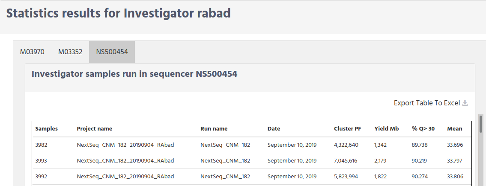

# Massive Sequencing Statistics

In the previous chapter we see the way that you can fetch information, about runs, projects, and samples. In this chapter we describe, the different statistics that you can get using iSkyLIMS.
So far have been created the following statistics:

*   Statistics per Investigator
*   Statistics for a period of time
*   Statistics per sequencer
*   Statistics library kit Quality

## Statistics per Investigator

Statistics per Investigator will show the information for the investigator and provide graphic to compare the investigator against the rest of investigators defined in iSkyLIMS.
To select this statistics, select “Projects per investigator” in the STATISTICS menu.

In the form that you get there are 3 fields.
The mandatory parameter is of course the investigator userID.
The other two fields related to dates are optional.

If no dates are defined in the forms iSkyLIMS provide you the statistics for all period, that the investigator was handling projects in the system.

If only the start date is defined, then you get statistics values from this date until today.
If on the contrary, you define the end date you get the statistics from the first day that Investigator was involved in a project until the end date you defined.
After you submit the data, you get a new page having the statistics related to the investigator.
So the first information that you get are the project that investigator was involved, displaying the following information:

### Display Investigator statistics

In

*   Project Name.
*   Date. It is the date from where the project starts in the sequencer as part of a run.
*    Library Kit. It is the library kit defined in the sample sheet. It is important to mention that this time we are talking about the sample sheet used to load in the sequencer.
*   Samples. Number of the samples in the project.
*   Cluster PF
*   Yield Mb
*    % Q >30

The meaning of these values were described on [Search by Run](searchGuide.md)

This information is showed for each of sequencer that investigator used. Click on the “Export Table to Excel” if you want to download this information.  

Bellow this information there are some graphics for project quality like “% Q>30”, “mean quality”.

## Statistics for a period of time

Next statistics will provide you information about the Runs, for a specific period of time.  
In the user form, as we mention above, **From Start date**, will defined which day you start collecting the information from database and the **End date** the last day iSkyLIMS collect data for doing the statistics.
Note that this time both fields are mandatory.
When submit the statistics information is presented, having the following information.

On the top you can see the number of Runs that were done during the selected period of time.
Then below the graphic with the numbers of runs created during this period.
.

On the right side you can see a table with all the Runs. You can download this table in an excel format, and you can have information of the Run, by clicking on the run name. You will get the same information as described [Display Run information](searchGuid.html#Display-Run-information)

The next graphic shows you the disk utilization per Run. Remember that disk space was calculated while collecting data from the output files of the sequencer. The present disk utilization could be changed from the time data was collected, because of the strategy in your unit to reduce disk space on the storage container

On the first part of this page we have showed you statistics data for Runs, now we are going to display project information for this period of time.
The first information now is the number of the projects, then the number of projects, and the lists of this projects.
You can download the project list and you can see a specific project by clicking on the project name.
The information that you will see on the project are the one described [Display Project information](searchGuid.html#Display-project-information)

The last graphic shows the total number of the Undetermined Barcode which are identified y the percentage that each one.

## Statistics per sequencer

Another statistic that you can get from iSkyLIMS is the sequencer utilization. In the form that is presented you must select one of the available sequencer that are defining in your system.

The 3 mandatory fields are:

*   Sequencer name
*   Start Date
*   End Date

After submit your request, several information is showed.
The first one on the top left area showed the completed runs that were executed on the sequencer. You can download this table in excel format by clicking on the “Export Table to Excel”

Below this table the Not completed runs are showed. Note that this table is optional and only is showed if there are some runs which are not completed.

On the right side the comparison graphic is showed to have an idea the utilization ratio that other sequencers are used.

Below this graphic you can see the number of days from the run is defined in iSlyLIMS until the run is completed on the sequencer.

The previous information gives you an overall idea about the sequencer utilization, but whit this information is not enough to see the “daily” work of the sequencer.

The next graphics will show you the number of the runs executed on the sequencer by month and just besides the Runs that are executed by other sequencer.

## Statistics library kit Quality
