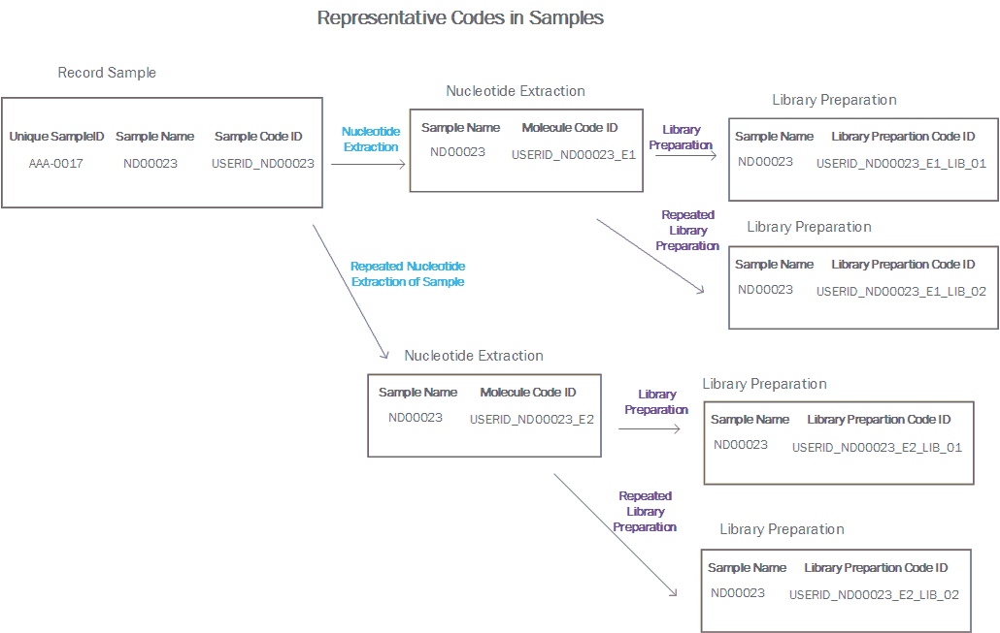

# Understanding Code ID


While reading this user guide, we have advice you to visit this chapter for having more details about how the sample is coding through the different steps.

## Sample_CodeID

Each time that a sample is recorded is assigned to a unique code.
The sample_codeID is created by joining the userID in iSkyLIMS and the sample name that user type when creating the sample.
The format is:

>   \<userID>\_\<sample_name>


The for example the sample codeID “**admin_Next-001**”, means that the user who registered the sample was the userid “admin” and the sample name was “Next-001”

We say that it is unique because sample name MUST be unique. Remember that this was one of the requirements that described at the [Introduction](../Introduction.md).

## Molecule CodeID

Molecule codeID is generated when the molecule extraction information is recorded.  
This code makes reference to the origin sample and it indicates the number of times of extractions that are done for the sample.  
The format is:

> \<sample\_codeID>\_E\<extraction number>

In the example “**admin_Next-001_E1**”, means that this extraction is from the sample Next-001, which was recorded by admin and it is the first molecule extraction done on this sample.

In case that it was required a new molecule extraction on this sample the molecule code is stepped in 1 unit, so it will be coded as “**admin_Next-001_E2**”.

## Library Preparation CodeID

Library preparation code is created when the user uploads the sample sheet, and it makes reference to molecule extraction codeID and a sequential number (2 digits long) that is stepped every time than a new library preparation is done for the same molecule extraction.

The format is:

> \<molecule\_codeID>\_LIB\_\<library preparation number>

Having an example “**admin_Next-001_E1_LIB_01**”, means that “admin_Next-001_E1” molecule extraction was used for the library preparation, and the “LIB_01” means that it is the first library preparation done on this molecule extraction.

When we need to repeat either the molecule extraction or the library preparation as you can guess, we are stepping in one unit.   
But we need to have also into consideration that not always we want to repeat the library preparation on the same sample of the molecule extraction.  
Sometime will need to repeat the molecule extraction or reuse an older one.

To handle all these scenarios, we are using the same philosophy as mention above.  
For example, if we need to repeat the molecule extraction for sample Next-001, we code it as:

> admin_Next-001_E2

Then we need to create the library preparation for this molecule extraction so the code is:

> admin_Next-001_E2_LIB_01

Other scenario we can face, is that we want to reuse the molecule extraction “admin_Next-001_E1” and we need repeat the library preparation.  
In this case the library preparation code is:

> admin_Next-001_E1_LIB_02

The figure below shows the coding for the examples that were described.



In the picture you will notice that there is another code (Unique SampleID) that we did not mention before. You do not worry we will talk about it later.

### Pool Code
Pool code is generated when a new pool is created. For coding it we use the date is created and again a sequence number, that it is stepped if more than one pool is created in the same date.
The format is:
```
<date>_<sequence_number>
```

As an example “**2020_02_25_1**” means that the pool was created the year of 2020 the month 2, (February) and the day 25.

The next value "1" means that it was the first pool that was created on the 25 of February 2.020. It number is "2" means that it was the second pool on that date and so on.

### Unique SampleID

The Unique SampleID it is created when the sample is recorded.  
To be unique we are using a code similar to the car label, which consists of 4 digits and 2 letters.  
The first sample that is recorded on iSkyLIMS has the code “0001-AA”, the second “0002-AA” and so on. When reach the 9999, the next sample will reset the digit numbers to “0001” and steps the character moving from “AA” to “AB”.

Having this format, we are sure that there is no duplication, but we talked before that we could reuse the sample. In this case the sample is reused either for a new molecule extraction or for a new library preparation will share the same “unique SampleID”. This duplication will make that our input file uploaded to Illumina BaseSpace was rejected.
To avoid it we need to modify the unique sampleID, having in mind that any of this repetitions could occur.  
The Unique SampleID format is:
<4digits-2letters> - <number_of_library_preparation_in_sample> - <number_of_library_preparation>
The example “0012-AA-1-0” means that the sample UniqueID used when recording the sample was “0012-AA”, the next digit “1” means that it is the first time that the library preparation was used for this sample, and the “0” means that this library preparation has not reused before.
To having more clear this code, imaging this scenario:
    • Sample Next-001 which has the uniqueID 0012-AA
    • We have repeated twice the molecule extraction, and complete the full process. It means, that we create each time a new library preparation, new poll and of course we create a new run
    • Then for the last library preparation we repeat the run, re-using the last pool.
The first part of the code is simple because is always the one that sample has (0012-AA). Then we add the number of times that library preparation was required. In our scenario, we create the library preparation the first time (1), then because we repeat the molecule preparation twice, we had to created 2 more library preparations for the sample. Then the value is 3, 1 + 2.
The last digit is the number of times that the library preparation was reused for creating a new pool or by reusing an existence the pool. In the example this value is “1” because we reused the pool.
Then the unique SampleID value is “0012-AA-3-1”.
