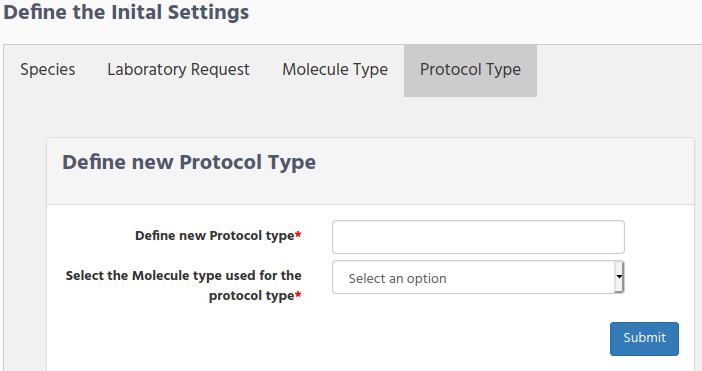

# Wetlab Manager Configuration

The following configuration is only available when your user login belongs to the “Wetlab Manager” group.

Wetlab Manager, has the responsibility to define the main parameters/settings that will be used in the Massive Sequencing application, and they will be the ones that are showed when the Investigator fill the information in the form.

There are 4 main groups for configuration:
*   Initial settings definitions
*   Used Kits in the laboratory
*   Protocol Parameters definitions
*   Samples parameter definitions

## Initial settings

There are 4 type of information that you need to define in the  **initial settings**
*   Species
*   Sample Origin
*   Molecule type
*   Protocol type

For selecting these settings select **Preliminary Preparation --> Initial Settings** from the main menu.

### Species definition
Define the name of the species that you are working with by clicking on the "Species" Tab.

Write the specie name and click on the Submit button.

As you can see on the right side "human" and "mouse" species are already defined. This was done during the installation.

### Samples Origin
Define the location from the sample could came from, by clicking on the "Sample Origin" Tab.

There are 3 fields that you need to fill in:
*   New Origin
*   Origin coding name
*   Location data

**New Origin** is the organization/hospital name who sends the sample to your organization.

**Coding name** is any short name that can identify the origin of the sample.

**Location data** is the country/Area which he origin is located.

For example if you receives samples from the Metropolitan Hospital at New York. You could define the samples origin fields like this:
*   New Origin. **Metropolitan Hospital**
*   Origin coding name. **Metropolitan**
*   Location data. **New York**

On the right side you will see the Samples Origin that have been defined so far.
### Molecule Type
During the installation 2 Molecule types were defined.
*   DNA
*   RNA

If you need to define an additional molecule type click on the "Molecule type" tab and write the new molecule type.

### Protocol Type

[Protocol Parameters definitions](#protocol-parameters-definitions)

ppopi

## Kits configuration

Inside the kits configuration, the following type of kits need to be defined:
*   Define the Collection Index kits
*   Define Commercial Kits
*   User Lot Commercial Kits

To store the different information that each organization needs for the laboratory samples, makes that iSkyLIMS has to be flexible by adding in the forms those parameters, but also do not consider the ones that we found as recommended.

To explain better, the “Samples Parameters”, let me show to you the information that you need to fill in, when defining a new sample.

# Protocol Parameters definitions

## Samples parameter definitions
