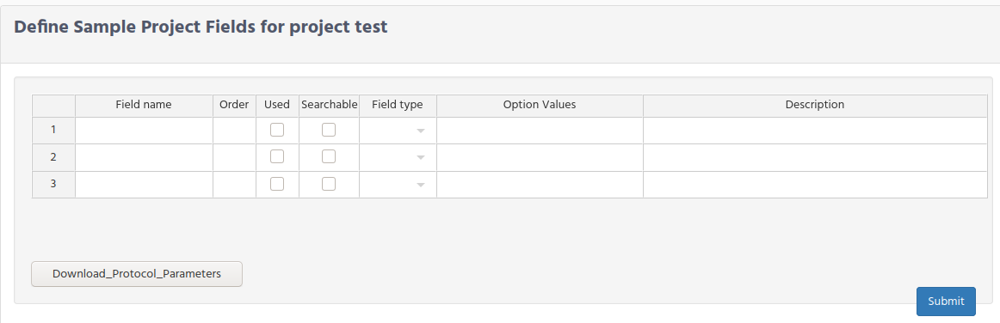
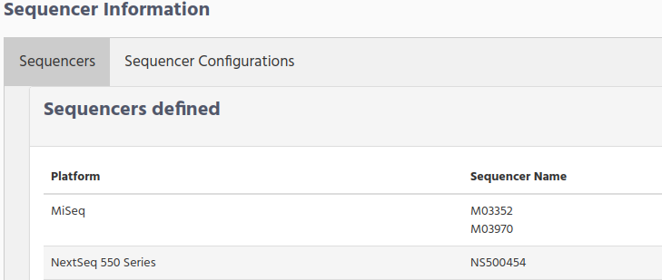
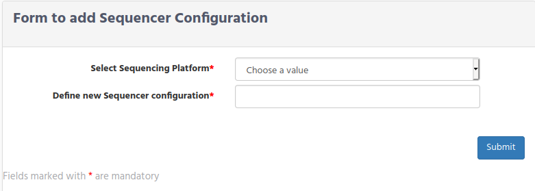

# Wetlab Manager Configuration

The following configuration is only available when your user login belongs to the “Wetlab Manager” group.

Wetlab Manager, has the responsibility to define the main parameters/settings that will be used in the Massive Sequencing application, and they will be the ones that are showed when the Investigator fill the information in the form.

There are 4 main groups for configuration:
*   Initial settings definitions
*   Protocol and Parameters definitions
*   Samples parameter definitions
*   Molecule uses
*   Commercial Kits used in the laboratory


## Initial settings
This section will show you how to define the initial data that Massive Sequencing module needs as base from where the rest of information is referenced to.  
During the installation already some data are loaded in database, but if you need to add extra information follow the instructions bellow.  
There are 4 type of information that you need to define in the  **initial settings**
*   Species
*   Sample Origin
*   Molecule type
*   Protocol type

For selecting these settings select **Preliminary Preparation --> Initial Settings** from the main menu.


### Species definition
Define the name of the species that you are working with by clicking on the "Species" Tab.


Write the specie name and click on the Submit button.

As you can see on the right side "human" and "mouse" species are already defined. This was done during the installation.

### Samples Origin
Define the location from the sample could came from, by clicking on the "Sample Origin" Tab.


There are 3 fields that you need to fill in:
*   New Origin
*   Origin coding name
*   Location data

**New Origin** is the organization/hospital name who sends the sample to your organization.

**Coding name** is any short name that can identify the origin of the sample.

**Location data** is the country/Area which he origin is located.

For example if you receives samples from the Metropolitan Hospital at New York. You could define the samples origin fields like this:
*   New Origin. **Metropolitan Hospital**
*   Origin coding name. **Metropolitan**
*   Location data. **New York**

On the right side you will see the Samples Origin that have been defined so far.
### Molecule Type
During the installation 2 Molecule types were defined.
*   DNA
*   RNA

If you need to define an additional molecule type click on the "Molecule type" tab and write the new molecule type.


### Protocol Type
During the installation 3 protocol types were defined:
*   DNA Extraction
*   RNA Extraction
*   Library Preparation

If you have a look to the right side, inside "Protocol Type" tab, you can see that **DNA Extraction** protocol type was defined to use **DNA** as molecule type. **RNA Extraction** use the **RNA** molecule and the **Library Preparation** does not use any molecule, because this protocol type will be used later, when defining the library preparation parameters.

These are the basic one that you will need when defining the Protocol and their parameter in section    [Protocol and Parameters definitions](#protocol-and-parameters-definitions). If you are new in iSkyLIMS, we recommended to you to keep these 3 protocol type settings, so you can skip this section and continue with the next section.

But if you need to add an additional protocol type, because you create a new type of molecule, or for any other reason, you can create a new one using the form inside "Protocol Type" tab.


## Protocol and Parameters definitions
When a protocol is defined it uses one of the "Protocol Type" that was defined during the installation or it was added in the previous section.

There are 2 steps to do when defining a new Protocol.
1. Define the Protocol name
2. Define the Parameters used on the protocol

### Protocol definition
To define a new protocol  select from the main menu PRELIMINARY PREPARATION  Create New Protocol.


**Select Protocol Type** shows you the list of available protocol types.

**Define new Protocol name** , write the name to identify the protocol-

**Description**, write some information about the scope and use of this protocol.

---
> You have to repeat this process to define a protocol for each protocol type defined:
>> *    "DNA Extraction" or "RNA Extraction" or both
>>      (depends on the sequence types, used in your organization)
>> *    "Library Preparation"
---

After click on the submit button the confirmation page is displayed allowing to continue with parameter used on this protocol.

### Protocol Parameter definitions

On the protocol parameter form, you can define the parameter names, the order that will be presented to the investigator when filling it, a checkbox to set if the parameter is used, range of values that parameter can have, and a short description of the parameter.


Notice that **Parameter name** and **Order** fields are mandatory. If Parameter Name is empty, the line is ignored.  

Click on the **Used** check box to display the parameter when Investigator fills the parameter values.

**Parameter Type** field, list the type of parameter for this parameter name. There are 3 types:

*   **string**. For having any kind of letter and numbers
*   **Date**. To display a calender
*   **Option List**. To select only the predefined values.

**Option Values** is only valid when the parameter is defined as "Option List". Set the possible values that parameter could have, when presenting to the Investigator as a selection option list.
To define the values, write them separating by commas “,” and without any blank space between the option values.

**Min Value** and **Max Value** are optional.

**Description** field is optional and you can type some few words to explain the parameter.

As normal protocol definition workflow, we mention before that when confirmation panel, after defining a new protocol,  you could click on the "add Parameter" button to add them. However, it is not mandatory that you fill this information on this moment, you can always add them, by defining a new protocol again, but now scroll down to the "protocol already defined for Molecules" panel.


In this panel you can check if the Protocol Parameters are defined or on the contrary they are pending.

To add the pending parameters, click on the "Define Protocol Parameters" button to get the table. Then write the information and submit the form.

As you will also notice when protocols parameters are defined, the button is replaced by a text, showing that parameters are defined, but also Protocol Name is now a link that when clicking on it, shows the parameter information.  

If you scroll further down, you can see similar panel but now the parameter are for the Library Preparations.


On this panel there are 2 tabs:
* Protocol Parameters
* Additional Lot Kit used in Protocol

Here the Protocol Parameter panel works as the same as mention above, you can see the protocol parameters by clicking on the link or add the pending parameter when click on the "Define Protocol Parameter" button.

We are skipping for now the second tab. We will go back to it when explaining the kits.

## Samples parameter definitions
To store the different information that each organization needs for the laboratory samples, makes that iSkyLIMS has to be flexible by adding in the forms those parameters, but also do not consider the ones that we found as recommended.

To explain better, the **Samples Parameters**, let us show to you the information that you need to fill in, when defining a new sample.


### Define Type of Sample

From the figure above you can see that there are 8 columns that you need to fill for every new sample you want to record in iSkyLIMS.

But, we have identified that sometimes, there are some fields which has no sense to fill any information, either it is not applicable or because it is an information that you never get.

This is the case for example when the sample that you receive is in a file format, like fasta file, bam file, etc.
In these cases, you do not have information about the patient name, the date when the sample was extracted, and of course has not sense to fill the information the location in the laboratory of the physical sample.

We do not consider the use of settings dummy values for these fields because it will create confusion and also fake values in the samples.

To have on iSkyLIMS, the flexibility for not filling some of the information that is no applicable for the type of sample we create a form, form which you can define, which parameters are optional or mandatory from the type of sample.

To define a new type of sample goes to the main menu on PRELIMINARY PREPARATION and select “Define Type of Samples”.


In the form, write the type of sample and click on the checkbox the field that will considered  **optional**. at the time to create a new sample.

If you scroll down you can see that there is a panel with the type of sample defined and clicking on the link you can see which fields are mandatory and which are optionals.


### Define Sample Project

When presenting the form for recording a new sample there are 8 fields (either mandatory or optional based on sample type) that we described before. We have found that these fields are not enough  for the information that you  need to store in database.

On that propose iSkyLIMS has the functionality to add the additional information to the sample by creating "Sample Projects" to handle all different possibilities that you could have.

To define the Sample Project, select “Create New Samples Projects” from the PRELIMINARY PREPARATION menu.


There are 2 forms for defining the Sample Project information.

On the first form you need to fill information related to the project information:
*   **Sample Project Name**. Write the project name, that is showed in the record sample  form
*   **Sample Project Manager**. Write the project name responsible
*   **Project Manager details contact** . Write information to allow you to contact the project manager
*   **Description**. Write a small description about the project

After submit the form a confirmation panel is showed, with a button to add the new fields belongs to the project.


When click on the button you will have the form to add the fields.



**Field name** Write the name of the field that will be showed later when investigator requested to add the information

**Order** write the order that the parameter is presented in the form


Click on the **Used** check box to display the parameter in the form.


**Field Type** select one of the 3 types:

*   **string**. For having any kind of letter and numbers
*   **Date**. To display a calender
*   **Option List**. To select only the predefined values.

**Option Values** is only valid when the parameter is defined as "Option List". Set the possible values that parameter could have, when presenting to the Investigator as a selection option list.
To define the values, write them separating by commas “,” and without any blank space between the option values.

**Description** field is optional and you can type some few words to explain the parameter.

```
To summarize the steps, to customize all the information that you need to record
for each sample are:
-   Define which fields are optional, using the form to define a new sample type,
-   Add more fields, by assigning the sample to a project using the
    Define Sample Project  form.
```

## Molecule use Definition
After processing in the laboratory the molecule extraction , either DNA or RNA, you need to define if the if you will use this molecule for massive sequencing or not.  
To set this configuration select PRELIMINARY PREPARATION -->**Define Molecule Use**


Write the name of the use for the molecule and click on the checkbox if it is used for massive sequencing.

## Commercial Kits used in the laboratory

Inside the kits configuration, the following type of kits need to be defined:
*   Define the Collection Index kits
*   Define Commercial Kits
*   Protocol kits
*   User Lot Commercial Kits


### Define the Collection Index kits

The collection index are the indexes that will be used in the preparation of the library.
During iSkyLIMS installation a set of collection index kits (according to version 1.18.1.0 of IEM) are loaded in iSkyLIMS.

In case that in your laboratory use other index, you can store your own collection index kit using the option "Add Collection Index Kit" from the PRELIMINARY PREPARATION menu.


> If you need to upload an Illumina collection kits, from a new IEM version, the
> files can be fetched, after the Illumina experiment manager (IEM) is installed,
> under folder “C:\Program Files (x86)\Illumina\Illumina Experiment Manager\IndexKits”.

If you want to upload a customized or from other vendor, the upload file must be in the Illumina index kit format.

Select the file and click on the Submit button to upload the file.

On the right side, the defined Collection index kit are listed. You can get a detail information of the Collection kit by clicking on the collection index name.

On the collection index information page you can see the library version, the name of the plate and the sequence of the adapters that the collection index kit uses.

In case that adapter 2 is not used in the collection index it is displayed as empty


The middle part is related to the index that kit uses. They are divided in 2 columns:
*   the one of the left contains the index name and the index sequence for the i7,
*   and on the right column the ones used for I5.

If a collection index is created for having “Single Read” it does not have the I5 indexes and the column on the right is not showed.

You can export the index table to excel file clicking on the “Export Table To Excel” button.


The last part contain the default layout recommended by Illumina. If you need it, you can download the settings layout by clicking on the “Export Table To Excel” button.


### Define Commercial Kits

The number of kits is used in many forms for collecting sample data workflow, to identify the lot number that was used in the sample.   
Having the lot number that was used in every sample process, allows to have statistics about the usage, identify which samples were processed with a specific/faulty lot,  but also it will help you in your internal/external audit.  
To help you in the usage of laboratory kits we have split the kits into 2 groups.
*   Commercial kits
*   User Lot kits

The idea of **Commercial Kits** definition is to define general information of the kit, to avoid to repeat every time that a new user Lot Kit is defined.

To define a new commercial kit, select the **Add Commercial Kit** from the PRELIMINARY PREPARATION option menu.

In the commercial Kit form there are 2 tabs for the 2 different uses:
*   Used in Protocols
*   Used in platforms


Kits defined for protocols requires for fill the following information.
*   **Select the Protocols used for the Kit**. Select from the list, all the protocols that you defined before, that are used for the kit.
*   **Select the Kit Provider company**.
*   **Cat No./ID**. Write the product code of the kit.
*   **Kit name**. Write the kit name that is used later for assigned the user lot kit.
*   **Description** Optionally write a description of the kit or any useful information

Fill the information and click on the submit button to apply changes.  
There are some kits that are not used for the protocols, but for the platform used for sequencing the samples.  
For them we have define this specific kit for "used on platforms".


*   **Select the Platform used for the Kit**. Select from the list, the platform that this kit is used.
*   **Select the Kit Provider company**.
*   **Cat No./ID**. Write the product code of the kit.
*   **Kit name**. Write the kit name that is used later for assigned the user lot kit.
*   **Description** Optionally write a description of the kit or any useful information

Click the submit button to save the information.

### Additional kits for Library Preparation

In the [Protocol Parameter definitions](#protocol-parameter-definitions) we left pending the configuration for the additional kits used for library preparation.

We did not defined in that moment, because as you can see, you need to select the commercial used for each additional library preparation kit.

To define the additional library preparation kits select "Create New Protocol" from the "PRELIMINARY PREPARATION", and scroll down until the "Protocols already defined for Library Preparations", and click on the "**Additional Lot Kit used in Protocol**".


Click on the "Define Additional Kits" bottom, to get the form for adding the information.


*   **Given name**. Enter the name that will be displayed in the form for additional kits form.
*   **Order**. Order that the additional kits are showed.
*   **Commercial Kit Name**. Select from the list the commercial kit related to the kit. If the right commercial kit is not present in the list, go back to Commercial Kit definition and add it.
*   **Description**. Write any value information

Define all kits that could be used in your library preparations, even if some of them are mutually exclusive.  
At the time that selecting the User Lot kit used, all these kits are optional and can left empty.

Click on the submit bottom to save the changes.

### User Lot Commercial Kits

We assigned the responsibility to fill the information about Lot kits to the investigator, because is the person who has more contact with the kits.  
But in case that Wetlab Manager needs to add this information, we have included this option the me menu. Click on the link to know the parameters that you have to define in [Investigator Configuration](investigatorConfiguration.html#User-Lot-Kit-Configuration)

## Define Sequencers

In the laboratory, in some occasion, you get the good news that there is a new sequencer in the lab.  
We have create a form to add the sequencer. Form that will be used during this first configuration of iSkyLIMS and later for adding a new sequencer.

Select "Sequencer Configuration" from the "PRELIMINARY PREPARATION" menu and fill the information in the new sequencer creation form.


*   **Select Platform**. Select the right platform from the list.
*   **Define Sequencer name** Write the name of the sequencer. It must be exactly the same as it is in the Instrument name field in the RunParameters.xml.
*   **Number of lanes** Write the number of lanes that the sequencer handles.
*   **Sequencer location**. Write the location of the sequencer.
*   **Serial number** Write the Serial number of the sequencer or the inventory number given on your organization.
*   **Sequencer Start in Service**. Select the date from where the Sequencer is on service.
*   **Description**. Write a short description about the sequencer.

Click on the submit bottom when all data is filled. You will get a confirmation window if the sequencer is updated or a error message if the Sequencer name was already in database.

Scrolling down you will see "Sequencers" tabs, where you can see all the sequencers defined.



## Sequencer Platform Configuration

Finally the last configuration from WetLab Manager is to define the set of configuration that each sequencer can have.

Select "Sequencer Configuration" from the "PRELIMINARY PREPARATION" menu and fill the information in the new sequencer configuration form.



*   **Select Sequencing Platform**. Select one platform from the list. You can get in the list, only the platforms which have a sequencer, that you defined in the previous step.
*   **Define new Sequencer configuration**. Write the configuration name.

Click on the submit bottom when all data is filled. You will get a confirmation window if the sequencer configuration is updated or a error message if the sequencer configuration was already in database.

Scrolling down you will see "Sequencers" tabs, where you can see all the sequencer configurations defined.


## Summary

As you see, there is quite a lot initial configuration that Wetlab Manager has to define to customize iSkyLIMS to their requirements.

We have created this chapter to summarize the configuration steps.
*  Define the Initial Settings
*  Define Protocols.
    *   For RNA Extraction
    *   For DNA Extraction
    *   For Library Preparation
*  Define Type of Samples
*  Define Project Samples
*  Define Molecule Use
*  Define the type of Kits used in the lab.
    *   Define the Collection Index kits. (Add new Collection Index Kit if the already defined during the installation did not fit to you).
    *   Define the Commercial Kits used for:
        *   DNA extraction.
        *   RNA extraction
        *   Library Preparation
        *   Protocol
*  Define Sequencers
*  Define Sequencer Platform Configuration
