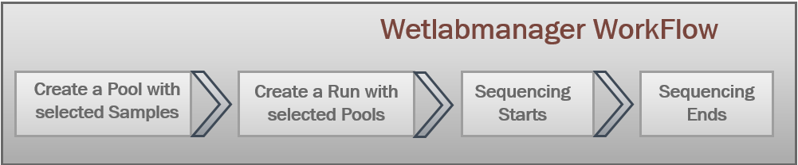
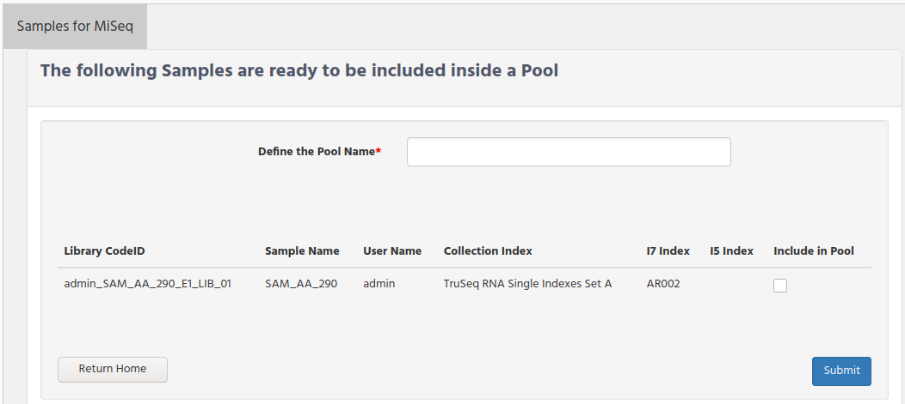
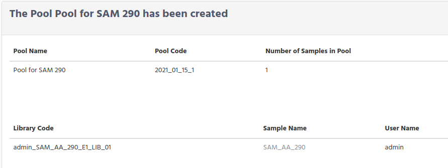
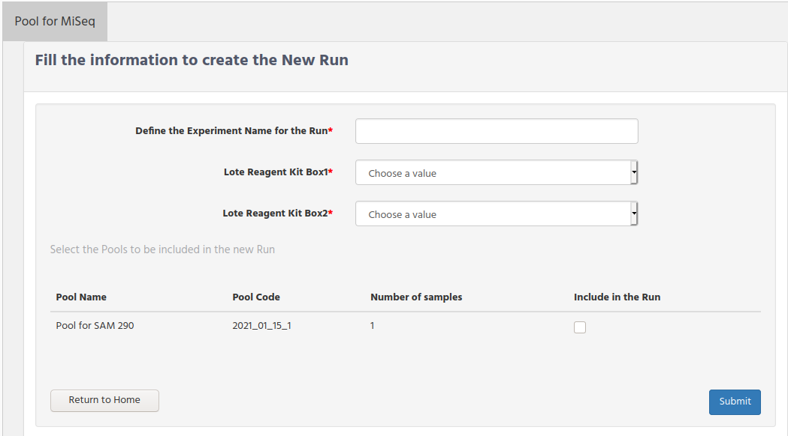
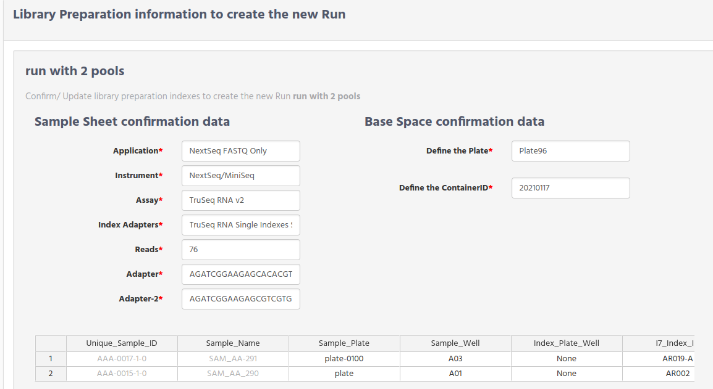

# WetlabManager workflow

The Wetlab Manager is now in charge to collect which samples are going to part of the run in the sequencer, and to order to star the sequencer.

The figure below describes the steps from the moment the sample is defined in iSkyLIMS until the information from the sequencers is collected.

The 2 main tasks for Wetlab Mananger now are:

1. Create Pool. by selecting samples to be included.
2. Create Run by selecting which pools are included.

## Create new Pool

To create a new pool select the "Create Pool" from "RUN PREPARATION" menu.

You will get a form with different tabs. Each tab contains the sample preparation that have been done for being used on different sequencers.

Then for example the following figure there is a tab "Sample for MiSeq", which have all the samples that were selected to be used for MiSeq.

If you have more samples, ready to include in a pool, on different sequencer you will get another tabs with the samples in it.  
Of course the tab is not showed if there is no sample for the platform. As in the figure the tab for NextSeq is not displayed.

*   **Define the Pool Name**, write the pool name, having in mind that the name cannot be repeated.
*   **Include in Pool**, select the samples that will be part of the pool

After submit the form you get a confirmation page with

**Pool Name** is the given name to the pool.  
For **Pool Code** and **Library Code** values check the [Understanding Code ID](understandingCodeID.md)

## Create new Run

To create a new run select the "Create New Run" option from the RUN PREPARATION menu.

As it happened when we create a new Pool, there are tabs that groups the pools based on the sequencers. So  as you can see on the figure below there is one tab for the pools that was prepared for MiSeq sequencer. You will tabs for every Pool that was prepared for using different sequencer.

*   **Define the Experiment for the Run** write the name that you are going to give for the run. You cannot repeat the run name, **Run name must be unique**. A error message is returned if the run name is already defined.
*   **Lote Reagent Kit Box1/Box2** These are optional fields to indicate the reagent kits, Although they are not needed for the run, we strongly recommend you include this information to have full traceability, because it is mandatory for certifications.

When you select the pools to include in the run , you will get a page similar to the sample sheet. Modify any wrong information and before submit the form, check that every sample have in the description field the user id of the responsible and the projects names are right.

You get a confirmation that the run was created and you can download the Sample Sheet file.

## Repeat/Create new NextSeq run
